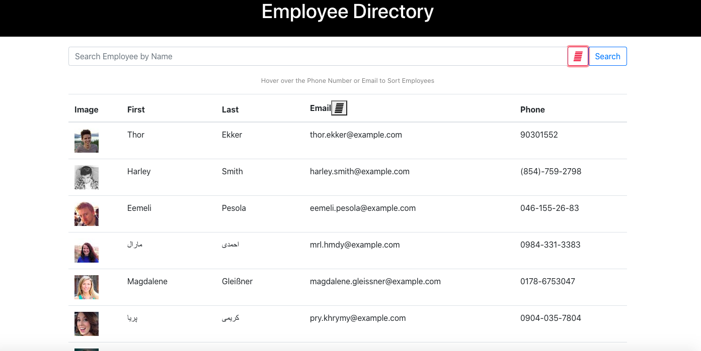
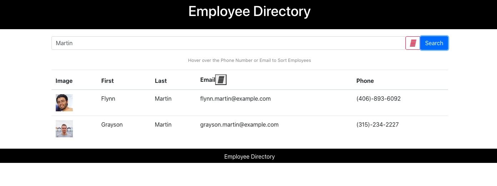

# Employee_Directory
<h3>Homework_week19</h3>

<!-- TABLE OF CONTENTS -->
<details open="open">
  <summary>Table of Contents</summary>
  <ol>
    <li>
      <a href="#about-the-project">About The Project</a>
    </li>
    <li><a href="#Technology">Technology</a></li>
    <li><a href="#getting-started">Getting Started</a></li>
    <li><a href="#learning">Learning</a></li>
    <li><a href="#license">License</a></li>
    <li><a href="#screenshots">Screen shots</a></li>
    <li><a href="#contact">Contact</a></li>
  </ol>
</details>


<!-- ABOUT THE PROJECT -->
## About The Project
Using react to create employee directory. 

## Technology

Major framework I used to create this application.

* [Javascript](https://www.javascript.com/)
* [React](https://reactjs.org/)
* [HTML]()
* [CSS]()

## Getting Started

To use budget tracker locally, use http://localhost:3000 after completing the following steps:

```js
git clone github.com/Chib1co/Employee-Directory
cd employee
npm install
npm start
```

## Learning

Using React to create employee directory. This is our first assignment using React. It took me a while to understand state, props, and component. Once my head was around, it is simple and very easy to organize but it took me a while for me to get there. 

<!-- LICENSE -->
## License
[](https://opensource.org/licenses/MIT)

## Screenshots

* Employee Table


* Searched by name



<!-- CONTACT -->
## Contact

Tomomi Inoue 
</br>

Project Link: [https://github.com/Chib1co/Employee_Directory](https://github.com/Chib1co/Employee_Directory)

Deployed page: [https://secret-shore-51741.herokuapp.com/](https://secret-shore-51741.herokuapp.com/)


